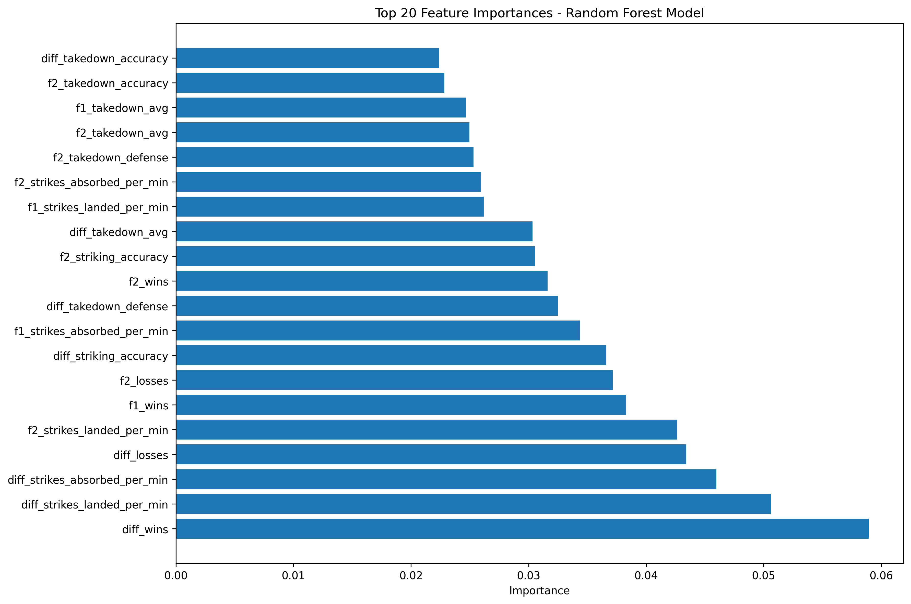
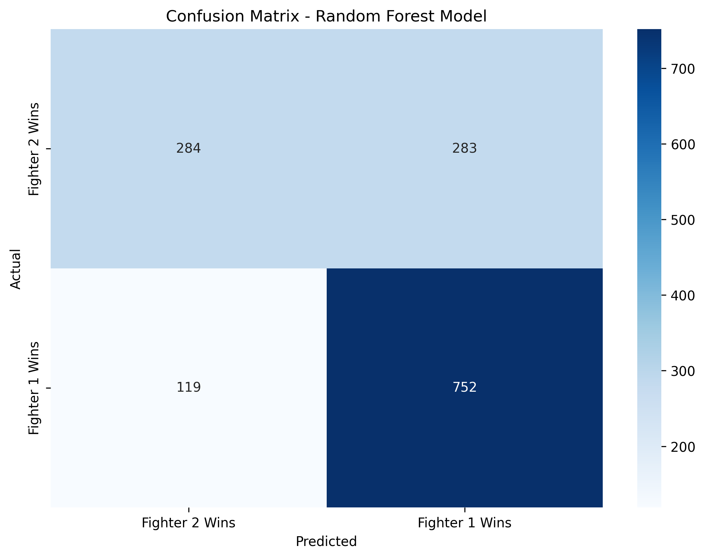

# UFC Fight Predictor

A machine learning project that predicts UFC fight outcomes using historical fighter statistics and performance data. Built with scikit-learn's Random Forest classifier, this model analyzes fighter metrics to forecast match results with 72% accuracy.

## Overview

This project leverages machine learning to predict the winner of UFC fights by analyzing comprehensive fighter statistics and historical fight data. The model uses a **Random Forest** classifier trained on thousands of UFC fights, incorporating various performance metrics such as striking accuracy, takedown defense, submission attempts, and career statistics.

The prediction system aims to identify patterns in fighter performance that correlate with fight outcomes, providing probabilistic predictions for upcoming matches.

## Performance

- **Accuracy**: 72% prediction accuracy on test data
- **Model Type**: Random Forest Classifier
- **Training Data**: Historical UFC fight records and fighter statistics (from ufcstats.com)

## Technical Specifications

### Machine Learning
- **Algorithm**: Random Forest Classifier
- **Framework**: scikit-learn
- **Language**: Python 3.x
- **Data Processing**: pandas, NumPy

### Key Libraries
- `scikit-learn` - Machine learning model implementation
- `pandas` - Data manipulation and analysis
- `NumPy` - Numerical computing
- `matplotlib/seaborn` - Data visualization (for plots and graphs)

## Data Collection

The project includes custom web scrapers that collect data from UFCStats.com:

- **`ufc_fighter_scraper.ipynb`** - Scrapes individual fighter statistics and career records
- **`ufc_fights_scraper.ipynb`** - Collects historical fight data and match outcomes
- **`ufc_event_scraper.ipynb`** - Gathers UFC event information

### Datasets

- **`fighter_stats_raw.csv`** - Raw fighter statistics from UFCStats.com
- **`fighter_stats_cleaned.csv`** - Processed and cleaned fighter data
- **`fights_cleaned.csv`** - Historical fight records with outcomes
- **`ufc_events.csv`** - UFC event metadata

## Methodology

### 1. Data Preprocessing
- Cleaning and normalizing fighter statistics
- Handling missing values and outliers
- Feature scaling and transformation

### 2. Feature Engineering
- Differential features (comparing fighter statistics)
- Career performance metrics
- Historical win/loss ratios
- Striking and grappling statistics

### 3. Model Training
- Random Forest classification
- Train/test split for validation
- Hyperparameter tuning
- Cross-validation for robust performance metrics

### 4. Evaluation
- Accuracy scoring
- Confusion matrix analysis
- Feature importance ranking
- Model performance visualization

## Visualizations

This section showcases key plots and graphs from the model analysis:
### Feature Importance



### Confusion Matrix



## Features

The model uses the following individual fighter statistics for each fighter in a matchup:

### Record & Physical Attributes
- **Wins** - Career wins
- **Losses** - Career losses
- **Draws** - Career draws
- **Height** - Fighter height (inches)
- **Weight** - Fighter weight (lbs)
- **Reach** - Fighter reach (inches)
- **Stance** - Fighting stance (Orthodox/Southpaw/Switch)

### Striking Statistics
- **Strikes Landed Per Minute** (SLpM) - Average strikes landed per minute
- **Striking Accuracy** - Percentage of strikes that land successfully
- **Strikes Absorbed Per Minute** (SApM) - Average strikes absorbed per minute
- **Striking Defense** - Percentage of opponent strikes avoided

### Grappling Statistics
- **Takedown Average** - Average takedowns landed per 15 minutes
- **Takedown Accuracy** - Percentage of takedown attempts that succeed
- **Takedown Defense** - Percentage of opponent takedowns defended
- **Submission Average** - Average submission attempts per 15 minutes

### Training the Model

1. Open the main Jupyter notebook:
   ```bash
   jupyter notebook new_model.ipynb
   ```

2. Run all cells to:
   - Load and preprocess the data
   - Train the Random Forest classifier
   - Evaluate model performance
   - Generate predictions

### Making Predictions

Use the trained model to predict upcoming fight outcomes by providing the fighter_id(from ufcstats.com) for both fighters.
